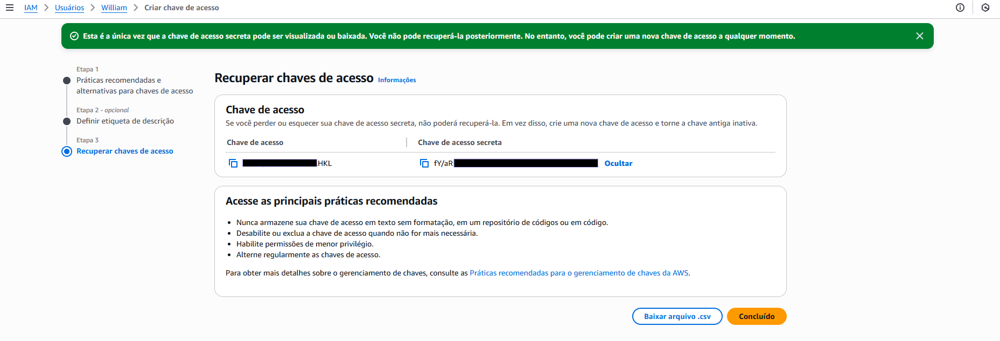

# orquestrador-mfe

Esse projeto, tem como objetivo criar um projeto de microfrontends usando module federation, react e deploy com a AWS.

### MicroFrontEnds relacionados

- [orquestrador-mfe](https://github.com/william-camasil/orquestrador-mfe)
- [login-mfe](https://github.com/william-camasil/login-mfe)
- [dashboard-mfe](https://github.com/william-camasil/dashboard-mfe)
- [cadastro-endereco-mfe](https://github.com/william-camasil/cadastro-pessoa-juridica-mfe)
- [cadastro-pessoa-fisica-mfe](https://github.com/william-camasil/cadastro-pessoa-fisica-mfe?tab=readme-ov-file#cadastro-pessoa-fisica-mfe)

## Erros durante subida para AWS

Documentação com os principais problemas identificados durante o deploy do module federation para AWS

### Cache ao sobrescrever build

Após alguns testes criando a pasta dist e sobrescrevendo no bucket da AWS S3, foi identificado que pode ocorrer um problema de cache o que impede de novas alterações serem implementadas após o deploy.

#### Instalação e Configuração do AWS CLI
Devido a esse problema, é necessário fazer algumas configurações no bucket do S3 via AWS CLI. Para isso precisamos [instalar o AWS CLI](https://docs.aws.amazon.com/cli/latest/userguide/getting-started-install.html#getting-started-install-instructions) e seguir as instruções de configuração.

Feito a instalação, abra qualquer terminal e execute o seguinte comando:
```
aws --version
```
Se aparecer algo nesse sentido:
```
aws-cli/2.x.x Python/3.x Windows/...
```
Quer dizer que deu certo a instalação.

Agora é necessário configurar a sua conta na AWS com o AWS CLI via terminal, para isso abra execute o seguinte comando no terminal:

```
aws configure
```

Irá pedir as seguintes credenciais, a qual será necessário obter essas informações a partir da AWS:
```
AWS Access Key ID [None]: ********
AWS Secret Access Key [None]: ********
Default region name [None]: us-east-1
Default output format [None]: json
```

Para obter as credencias, no console da AWS, busque por IAM > usuários > Escolha/Crie um usuário > Credenciais de Segurança > Criar chave de acesso.

Após criar a chave de acesso, exemplo:


Baixe o arquivo.csv e copie a chave de acesso e a chave de acesso secreta, a qual serão utilizados no terminal, sendo  

```
// Chave de acesso
AWS Access Key ID [None]: ********HKL
// Chave de acesso secreta
AWS Secret Access Key [None]: fY/aR+********
// Local onde foram criados os buckets
Default region name [None]: us-east-1
// Formato da saída das informações
Default output format [None]: json
```

Feito essa configuração execute o seguinte comando:
```
aws s3 ls
```
OBS.: é importante informar que o usuário a qual foi feito a configuração de chaves de acesso, precisa ter acesso aos serviços que serão manipulados via AWS CLI, ou seja nesse caso precisa ter acesso ao S3 e ter buckets criados.

Após executar o comando, deve ser mostrados os buckets relacionados a conta.

Ex.:
```
PS C:\Users\william> aws s3 ls
2026-01-07 15:50:37 s3-mfe-poc
2025-12-29 16:29:04 will-s3-react-s3
2026-01-05 09:44:37 will-s3-react-s3-mfe
```

#### Resolvendo o problema de cache
Agora que temos acesso a AWS CLI, precisamos configurar o S3 para ajustar o problema de cache ao sobrescrever o build.

Vamos pegar como exemplo o MFE de [login](https://github.com/william-camasil/login-mfe). No terminal, execute o seguinte comando: 

```
aws s3 ls s3://s3-mfe-poc/login-mfe/
```
O comando deve ser considerado da seguinte forma *aws s3 ls* comando aws para ver quais pastas e arquivos existem dentro de um diretório, *s3://s3-mfe-poc* bucket criado no S3 e *login-mfe* nome da pasta onde foram adicionados os arquivos de build. O retorno será o seguinte:

```
2026-01-08 08:36:19          0
2026-01-08 08:41:44       3638 342.js
2026-01-08 08:41:44        239 342.js.LICENSE.txt
2026-01-08 08:41:44       1501 490.js
2026-01-08 08:41:45       7562 540.js
2026-01-08 08:41:45        235 540.js.LICENSE.txt
2026-01-08 08:41:40       4115 599.js
2026-01-08 08:41:41     182047 814.js
2026-01-08 08:41:41        486 814.js.LICENSE.txt
2026-01-08 08:41:42       3638 961.js
2026-01-08 08:41:42        239 961.js.LICENSE.txt
2026-01-08 08:41:43       5912 main.js
2026-01-08 08:41:43       6421 remoteEntry.js
```

Feito isso, agora com o projeto local, acessamos o diretório ./dist contendo o build do projeto login por exemplo, e executamos o seguinte comando, para remoteEntry.js:
```
aws s3 cp .\dist\remoteEntry.js s3://s3-mfe-poc/login-mfe/remoteEntry.js --cache-control "no-cache, no-store, must-revalidate" --content-type "application/javascript" --metadata-directive REPLACE
```

Para index.html:
```
aws s3 cp .\dist\index.html s3://s3-mfe-poc/login-mfe/index.html --cache-control "no-cache, no-store, must-revalidate" --content-type "text/html" --metadata-directive REPLACE
```

Por fim, execute o seguinte comando:
```
aws s3api head-object --bucket s3-mfe-poc --key login-mfe/remoteEntry.js
```

O retorno deve ser o seguinte:
```
{
    "AcceptRanges": "bytes",
    "LastModified": "2026-01-08T16:52:49+00:00",
    "ContentLength": 6421,
    "ETag": "\"83a0a9e111499cb8b79cadc666a71a32\"",
    "CacheControl": "no-cache, no-store, must-revalidate",
    "ContentType": "application/javascript",
    "ServerSideEncryption": "AES256",
    "Metadata": {}
}
```

A qual foi aplicado o "CacheControl": "no-cache, no-store, must-revalidate" que remove o cache do deploy feito no Login, dessa forma volta ao tentar acessar o site novamente, é mostrado o site atualizado com as alterações.

OBS.: usamos o login-mfe como exemplo, esse mesmo processo pode ser realizado nos demais MFEs basta alterar os diretórios.

Com o AWS CLI, é possivel fazer tudo a partir dele, não sendo necessário abrir o console da AWS, só precisa se atentar que a chave de acesso obtida, a depender do que foi liberado, tem serviços que não serão possiveis ter o acesso.

## Links

[Referência para desenvolvimento](https://github.com/william-camasil/home-app-fed)
